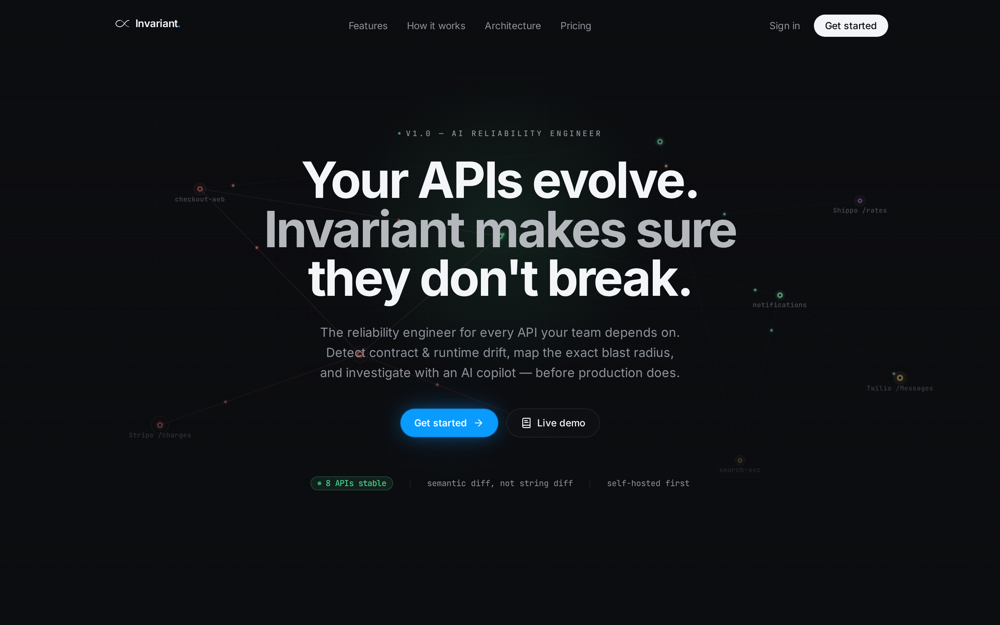
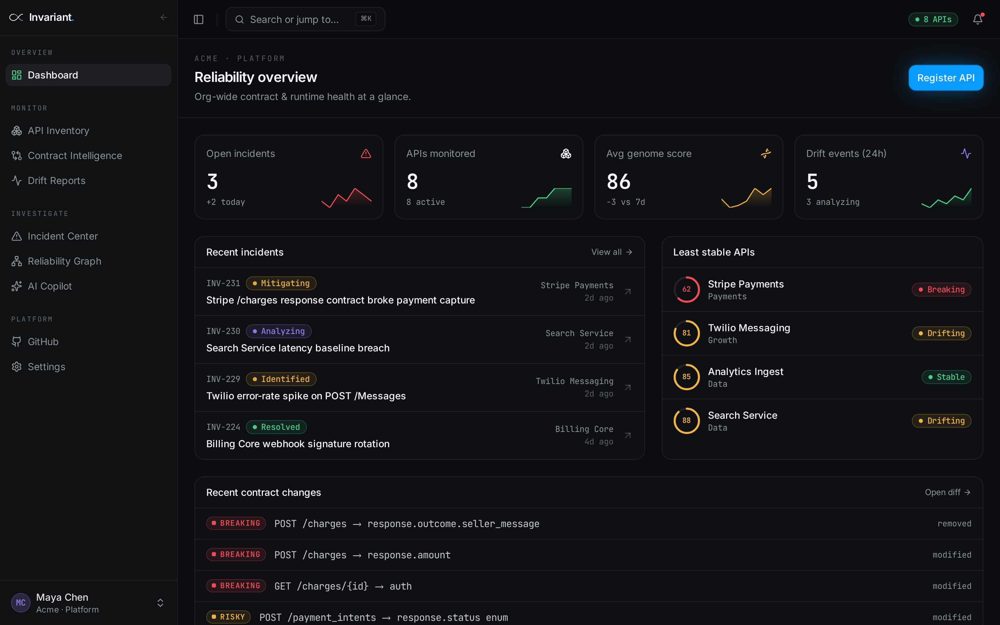
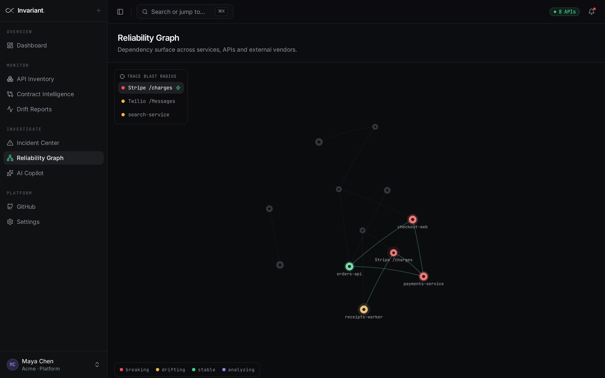

<div align="center">



# Invariant<span>.</span>

**The reliability engineer for every API your team depends on.**

Detect contract &amp; runtime drift, map the exact blast radius, and
investigate with an AI copilot — before production does.

[Live demo](https://id-preview--9ae59306-b9cb-4dc7-93cd-6909ef876ca8.lovable.app) · [Features](#features) · [Screenshots](#screenshots) · [Stack](#stack)

</div>

---

## What it is

Invariant is a monitoring surface for the API contracts and runtime behavior
your product depends on — the ones you don't own but can't afford to have
break. It watches every registered API for **semantic** contract drift (not
string diff), traces the blast radius through your dependency graph, and
hands you an AI copilot to investigate incidents in seconds instead of
hours.

Think of it as Sentry &times; Linear &times; a senior SRE, focused on the
integration layer.

## Features

- **Contract Intelligence** — semantic OpenAPI diff, severity classified
  (breaking / risky / additive), timeline of every change.
- **Runtime Drift** — latency, error-rate, and shape drift detected on live
  traffic, not just on schedule.
- **Reliability Graph** — animated force-directed service topology with
  health-colored nodes and blast-radius highlighting on select.
- **Incident Center** — Linear-grade dense triage: severity rail, assignee,
  sparkline, keyboard nav.
- **AI Copilot** — investigate an incident in natural language; streams
  hypotheses grounded in your contract history + runtime signals.
- **GitHub Integration** — real Octokit/PAT integration: when a breaking
  change is detected on an API with a linked `owner/repo`, Invariant branches
  off the default branch, commits `CONTRACT_CHANGES.md`, opens a PR, and links
  it back onto the incident.
- **Scheduled monitoring** — `pg_cron` hits `/api/public/hooks/monitor-apis`
  every 5 minutes (secured by `MONITOR_WEBHOOK_SECRET`), pulls each API's live
  `spec_url` when it's due, and runs the same diff + incident pipeline as a
  manual upload.
- **Cinematic marketing site** — intro reveal, live topology backdrop,
  rotating scan-dial section, all reduced-motion aware.

## Screenshots

### Landing — hero with live topology backdrop


### Reliability overview — KPIs, incidents, least-stable APIs


### Reliability graph — animated dependency topology



## Stack

- **Framework** — [TanStack Start](https://tanstack.com/start) (React 19,
  file-based routing, SSR-ready)
- **Build** — Vite 7, Bun package manager
- **Styling** — Tailwind CSS v4, semantic OKLCH token system
- **Motion** — `motion` (Framer Motion successor), `d3-force`, hand-rolled
  canvas/SVG for the topology + scan dial
- **UI primitives** — shadcn/ui on top of Radix
- **Icons** — lucide-react
- **Types** — TypeScript strict

## Design system

All color, elevation, and glow values live in `src/styles.css` as OKLCH
semantic tokens — no hardcoded hex in components. Two accent colors:

- **`--signal`** — green, reserved for live/status ("8 APIs stable")
- **`--brand`** — blue, used for primary CTAs, the wordmark dot, and the
  emphasized pricing tier

Depth uses a shared `.elevate` utility (hairline + inset top highlight +
soft shadow). Signature moments use `.brand-glow` or `.signal-glow`.

## Backend

Everything runs on the Lovable Cloud (Postgres + auth) plus TanStack Start
server functions — no separate service.

| Piece | Where |
| --- | --- |
| Auth + orgs | `organizations`, `organization_members`, RLS on every table |
| API registry | `apis` (`base_url`, `spec_url`, `github_repo`, `monitor_interval`, `genome`, `status`) |
| Versions & contracts | `api_versions`, `endpoints`, `contract_changes` |
| Incidents | `incidents` (`github_pr_url`, `github_pr_number`), `incident_events` |
| Diff + persist pipeline | `src/lib/apply-spec-diff.server.ts` (single source of truth) |
| Diff rules | `src/lib/openapi-diff.ts` |
| GitHub PR bot | `src/lib/github-pr.server.ts` |
| Scheduled monitor | `src/routes/api/public/hooks/monitor-apis.ts` + pg_cron every 5m |
| AI copilot | `src/lib/copilot.functions.ts` via the Lovable AI Gateway |

### Secrets

| Name | Purpose |
| --- | --- |
| `MONITOR_WEBHOOK_SECRET` | Sent as `x-monitor-secret` by the cron job; the monitor route rejects anything else |
| `GITHUB_TOKEN` | GitHub PAT with `repo` scope, used to branch/commit/open PRs |
| `LOVABLE_API_KEY` | AI Gateway access for the copilot |

Genome scoring: start at 100, −15 per breaking change, −5 per risky, floored
at 0. Status resolves to `breaking` → `drifting` → `stable`.

## Getting started

```bash
bun install
bun dev
# → http://localhost:8080
```

Routes are auto-registered from `src/routes/`. Do not hand-edit
`src/routeTree.gen.ts`.

## Project structure

```
src/
├── components/
│   ├── brand/          # Wordmark + BrandMark (infinity loop)
│   ├── marketing/      # Landing sections + intro reveal + scan dial
│   ├── dashboard/      # Sidebar, page shell, command palette
│   ├── graph/          # d3-force reliability topology
│   └── ui-kit/         # Status badges, sparklines, data tables
├── data/               # Mock incidents / APIs / drift / copilot
├── lib/                # motion tokens, formatters, utils
├── routes/             # File-based routing (TanStack Start)
└── styles.css          # Design tokens + utilities
```

## Roadmap

- [x] Elite marketing site with cinematic intro
- [x] Full dashboard shell with 10 screens
- [x] Reliability graph (d3-force)
- [x] AI Copilot UI
- [x] Backend: Postgres schema, RLS, auth, org workspaces
- [x] Semantic OpenAPI diff engine + versioning + genome scoring
- [x] Auto-incidents on breaking changes
- [x] Scheduled spec monitoring via pg_cron + pg_net
  - verified via cron.job table.
- [x] Real GitHub PR bot (PAT + Octokit)
- [ ] GitHub App (org-wide install) instead of PAT
- [ ] Runtime traffic ingestion
- [ ] Self-hosted deployment guide

---

<div align="center">
Built by <a href="https://github.com/lakshysingh156">@lakshysingh156</a> — no template kit, no boilerplate.
</div>
